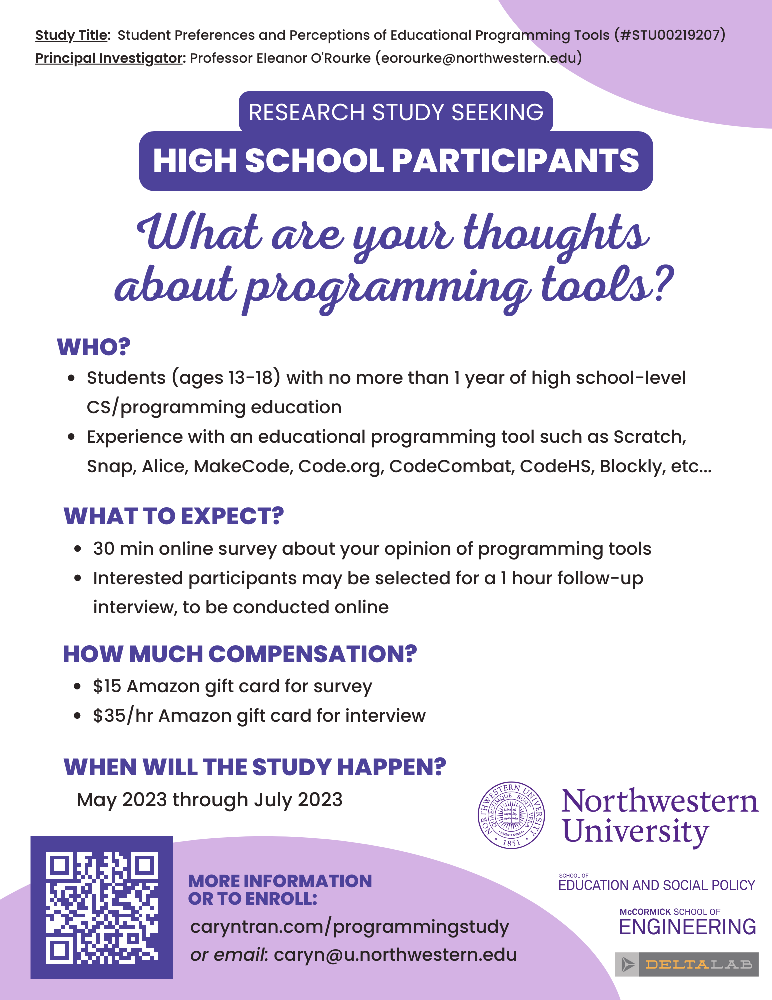

## Preferences and Perceptions of Programming Study
### Study Conducted by Northwestern University

### Contacts
- **Principal Investigator:** [Eleanor O'Rourke](http://www.eleanorourke.com/), [eorourke@northwestern.edu](mailto:eorourke@northwestern.edu)
- **Graduate Researcher:** Caryn Tran, [caryn@u.northwestern.edu](mailto:caryn@u.northwestern.edu)

### Interested?
| Interested participants: | (If under 18) Guardian: |
|:---:|:---:|
| <a href="https://northwestern.az1.qualtrics.com/jfe/form/SV_3WwnEUbQZU9Fv14" class="btn btn-primary">Fill out Interest Form</a> |<a href="https://northwestern.az1.qualtrics.com/jfe/form/SV_74lL0WpsWhdQTEG" class="btn btn-secondary">Fill out Parent Permission Form</a> |

We will follow up with next steps shortly. If you have any questions, please email [caryn@u.northwestern.edu](mailto:caryn@u.northwestern.edu). 

**For teachers who are interested in having students do this survey as an in-class activity**, please send your students the interest and permission forms above and contact me via email so we can coordinate how to send out the survey. 
  
---

#### **Activity**
- Students will answer a survey about their programming preferences and perceptions. 
- Selected students who are interested will be contacted for an optional follow-up interview about their survey response.

#### **Student Benefits**
- They get to see what research looks like (learning sciences and human-computer interaction research).
- They will be compensated $15-$50 ($15 for the survey, $35/hr for the interview).
- They will reflect on their preferences and perceptions of programming and learn about new tools for learning programming.
- More?! I'm happy to brainstorm any other ideas that you might think will benefit students!

#### **Consent**
- Students need to get parent consent for participating in the study. Participation is completely voluntary.

#### **Teacher’s Responsibility**
Teachers need to give students two links and that’s it! 
- One link is a link to an online [permission form](https://northwestern.az1.qualtrics.com/jfe/form/SV_74lL0WpsWhdQTEG) and the other is a link to [the interest form](https://northwestern.az1.qualtrics.com/jfe/form/SV_3WwnEUbQZU9Fv14). 
- This is a great activity for students to complete at the end of the year. 
- Results from the study can help you inform your curriculum in the future.  

#### **Eligibility**
Students should:
- be between the ages of 13 and 18, 
- have no more than 1 year of formal high school-level Computer Science or Programming coursework. 
    - If you are currently enrolled in a Computer Science/Programming class, that's okay! 
    - If you've taken any courses prior to high school or outside of school, that's okay too!
- have experience using an _educational_ programming environment 
    - such as (but not limited to) Scratch, Snap, MakeCode, CodeHS, Alice, CodeCombat, Code.org, AppInventor, and so on. 

#### **Timing**
- For the 30 minute survey, students can participate at any time (so long as guardian permission is given).\\
- For the 1 hour follow-up interview, students who are interested may be contacted by email to select a time that works for them on a Calendly link.

#### **Location**
- The survey is completed in Qualtrics wherever the student has internet access. 
- The interview is done on Zoom in a password-protected meeting. 

---

---

